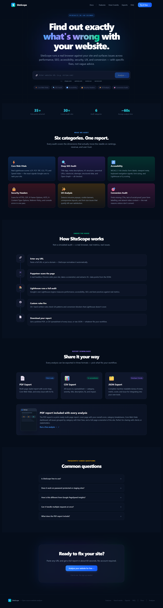
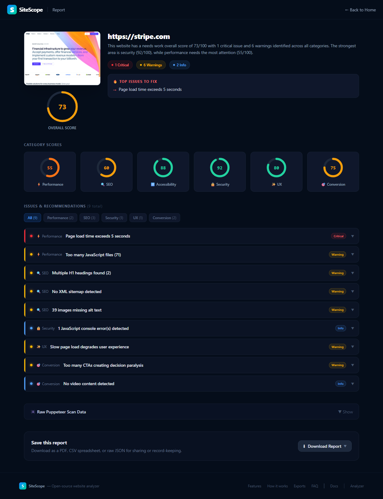

# SiteScope — Website Analyzer

> **Live Demo:** [https://sitescope-qbdf.onrender.com](https://sitescope-qbdf.onrender.com)

A full-stack website auditing tool that runs a real headless browser against any URL and surfaces issues across performance, SEO, accessibility, security, UX, and conversion — with specific fixes, not vague advice.

Built with Next.js, Puppeteer, Lighthouse, and a custom rules engine. Designed to be self-hosted and deployable in minutes.

---

## Preview

<details>
<summary>Homepage</summary>



</details>

<details>
<summary>Report</summary>



</details>

---

## Tech Stack

| Layer              | Tool                                      |
| ------------------ | ----------------------------------------- |
| Frontend           | Next.js (App Router) + Tailwind CSS       |
| Browser automation | Puppeteer                                 |
| Performance audit  | Lighthouse (via Puppeteer wsEndpoint)     |
| Custom rules       | TypeScript rules engine (UX + Conversion) |
| Concurrency        | Browser pool + Lighthouse queue           |
| Report export      | jsPDF (PDF), CSV, JSON                    |
| Report Caching     | Redis                                     |

---

## Features

### Six audit categories

| Category             | What's checked                                                                           |
| -------------------- | ---------------------------------------------------------------------------------------- |
| ⚡ **Performance**   | LCP, FCP, TBT, CLS, TTI, Speed Index, page load time, script count                       |
| 🔍 **SEO**           | Title, meta description, H1, canonical, robots.txt, sitemap, structured data, Open Graph |
| ♿ **Accessibility** | Viewport meta, form labels, image alt text, Lighthouse a11y score                        |
| 🔒 **Security**      | HTTPS, CSP, X-Frame-Options, HSTS, X-Content-Type-Options, Referrer-Policy               |
| ✨ **UX**            | Mobile responsiveness, popup overload, font size, perceived load time                    |
| 🎯 **Conversion**    | CTA detection, social proof, form quality, video content                                 |

### Report exports

- **PDF** — multi-page styled report with score rings, Core Web Vitals, all issues, and a screenshot
- **CSV** — every issue as a spreadsheet row (category, severity, title, description, fix, impact)
- **JSON** — full machine-readable dump of all metrics, scores, and issues

### Concurrency

- **Browser pool** — fixed set of reusable Puppeteer browsers (default: 3). Requests queue automatically when all browsers are busy
- **Lighthouse queue** — serialises Lighthouse runs to prevent Chrome port conflicts
- **`GET /api/status`** — live pool and queue stats for monitoring

### Pages

- **`/`** — landing page with the main URL input and other sections (e.g. features, faq)
- **`/report`** — shows the full audit report dashboard including scores and metric breakdowns
- **`/docs`** — explains exactly how each audit category works, what thresholds are used, and known limitations

---

## Running Locally

### Prerequisites

- Node.js 18+
- Chrome or Chromium installed

### Install

```bash
git clone https://github.com/mdshakerullahS/sitescope.git
cd sitescope
npm install
```

### Environment variables

Create `.env.local` in the project root:

```env
# Path to your Chrome/Chromium binary
# Linux:   /usr/bin/google-chrome-stable
# macOS:   /Applications/Google Chrome.app/Contents/MacOS/Google Chrome
# Windows: C:\Program Files\Google\Chrome\Application\chrome.exe
CHROME_PATH=/usr/bin/google-chrome-stable

# Optional tuning
BROWSER_POOL_SIZE=3       # concurrent Puppeteer browsers (~300MB RAM each)
LIGHTHOUSE_CONCURRENCY=1  # parallel Lighthouse runs
```

### Run

```bash
npm run dev      # http://localhost:3000
npm run build    # production build
npm start        # production server
```

---

## Running with Docker

```bash
docker build -t sitescope .
docker run -d -p 3000:3000 sitescope
```

Then open `http://localhost:3000`.

---

## Project Structure

```
src/
├── app/
│   ├── page.tsx                    # URL input + animated progress + landing page
│   ├── report/page.tsx             # Full report page
│   ├── docs/page.tsx               # Audit documentation + limitations
│   └── api/
│       ├── analyze/route.ts        # POST /api/analyze — orchestrates everything
│       └── status/route.ts         # GET /api/status — live pool/queue stats
├── components/
│   ├── home/                       # Components used in the homepage
│   ├── report/                     # Components used in the report page
│   └── ...                         # Other components (e.g. Logo)
├── lib/
│   ├── puppeteer-scanner.ts        # Headless browser scan — 35+ data points
│   ├── lighthouse-queue.ts         # Serialised Lighthouse queue
│   ├── browser-pool.ts             # Reusable Puppeteer browser pool
│   ├── custom-rules.ts             # 30+ audit rules + score calculation
│   ├── pdf-generator.ts            # jsPDF multi-page report generator
│   ├── redis.ts                    # Cache report for faster result
│   └── download-utils.ts           # CSV + JSON export helpers
└── types/index.ts                  # Shared TypeScript interfaces
```

---

## How an Analysis Works

```
POST /api/analyze
       │
       ├─ 1. Puppeteer (browser pool)
       │      └─ Headless Chrome visits the URL
       │         Takes a screenshot
       │         Extracts 35+ DOM data points
       │         Checks robots.txt + sitemap.xml
       │
       ├─ 2. Lighthouse (serialised queue)
       │      └─ Full Core Web Vitals audit
       │         Performance, Accessibility, SEO, Best Practices scores
       │
       ├─ 3. Custom Rules Engine
       │      └─ 30+ rules across all 6 categories
       │         Severity scoring (critical / warning / info)
       │         Per-category and overall score calculation
       │
       └─ 4. Response → /report page
              Screenshot · Scores · Issues · Core Web Vitals
              Download as PDF / CSV / JSON
```

---

## Adding Custom Audit Rules

Open `src/lib/custom-rules.ts` and add to the `runCustomRules` function:

```typescript
if (someCondition) {
  issues.push({
    id: id(),
    category: "Conversion", // Performance | SEO | Accessibility | Security | UX | Conversion
    severity: "warning", // critical | warning | info
    title: "Short title",
    description: "What the issue is and why it matters.",
    fix: "Specific actionable fix.",
    impact: "Business or user impact.",
  });
}
```

---

## Contact

**Your Name**

- GitHub: [@mdshakerullahS](https://github.com/mdshakerullahS)
- LinkedIn: [linkedin.com/in/mdshakerullah](https://linkedin.com/in/mdshakerullah)
- Email: sourovmdshakerullah@email.com

---

## License

This project is licensed under the MIT License. See the [LICENSE](LICENSE)
file for full details.
